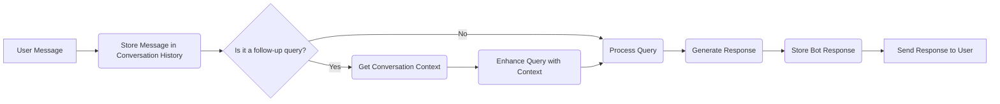

# Conversation Management in Publicia

Publicia maintains a conversation history with each user to provide context for follow-up questions and improve the relevance of responses. This document explains how conversation history is managed.

## Overview

Conversation history is stored in individual JSON files for each user. The `ConversationManager` class handles the storage, retrieval, and management of these conversations. The `DiscordBot` class integrates with the `ConversationManager` to store messages and use conversation history when processing user queries.

## Storage

-   Conversations are stored in the `conversations` directory.
-   Each user has a separate JSON file named with their sanitized username (e.g., `conversations/JohnDoe.json`).
-   The JSON file contains an array of message objects. Each message object has the following structure:

    ```json
    {
        "role": "user" or "assistant",
        "content": "The message content",
        "timestamp": "ISO 8601 timestamp",
        "channel": "Discord channel name (optional)"
    }
    ```

## `ConversationManager` Class (`managers/conversation.py`)

The `ConversationManager` class provides the following methods:

-   **`__init__(self, base_dir="conversations")`:** Initializes the manager, creates the `conversations` directory if it doesn't exist, and migrates any old conversation formats.
-   **`get_file_path(self, username)`:** Generates a sanitized file path for a user's conversation file.
-   **`migrate_old_conversations(self)`:** Migrates old text-based conversation files (.txt) to the JSON format.
-   **`migrate_old_json_format(self)`:** Migrates older JSON formats to the current, simpler array format.
-   **`read_conversation(self, username, limit=10)`:** Reads the most recent `limit` messages from a user's conversation history. Returns an empty list if the file doesn't exist or if there's an error.
-   **`write_conversation(self, username, role, content, channel=None)`:** Appends a new message to a user's conversation history.  Creates the file if it doesn't exist.  Limits the conversation size to a maximum number of messages.
-   **`get_conversation_messages(self, username, limit=50)`:** Retrieves the conversation history in a format suitable for use with the LLM.  This returns a list of dictionaries, each with `role` and `content` keys.
-   **`limit_conversation_size(self, username, max_messages=50)`:**  Truncates a user's conversation history to the most recent `max_messages`.
-   **`get_limited_history(self, username, limit=10)`:** Gets a limited view of recent history with display indices for deletion.
-   **`delete_messages_by_display_index(self, username, indices, limit=50)`:** Deletes messages based on display indices.
-  **`archive_conversation(self, username, archive_name=None)`:** Archives a conversation.
- **`list_archives(self, username)`:** Lists archived conversations.
- **`swap_conversation(self, username, archive_name)`:** Swaps the current conversation with an archived one.
- **`delete_archive(self, username, archive_name)`:** Deletes an archived conversation.

## `DiscordBot` Integration (`bot.py`)

-   The `DiscordBot` class initializes a `ConversationManager` instance in its `__init__` method.
-   **`on_message`:**
    -   Calls `self.conversation_manager.write_conversation` to store both user and bot messages after processing a user's query.
- **`process_hybrid_query`:**
    - Calls `self.is_context_dependent_query` to check if the current query is a follow up.
    - Calls `self.conversation_manager.get_conversation_messages` to retrieve conversation history.
    - Calls `self.get_conversation_context` to extract relevant context from the conversation history, which is used to enhance context-dependent queries.
- **`get_conversation_context`:**
    - Calls `self.conversation_manager.get_conversation_messages` to retrieve the conversation history.
    - Extracts the last substantive user query and the last assistant response to use as context.

## Workflow


