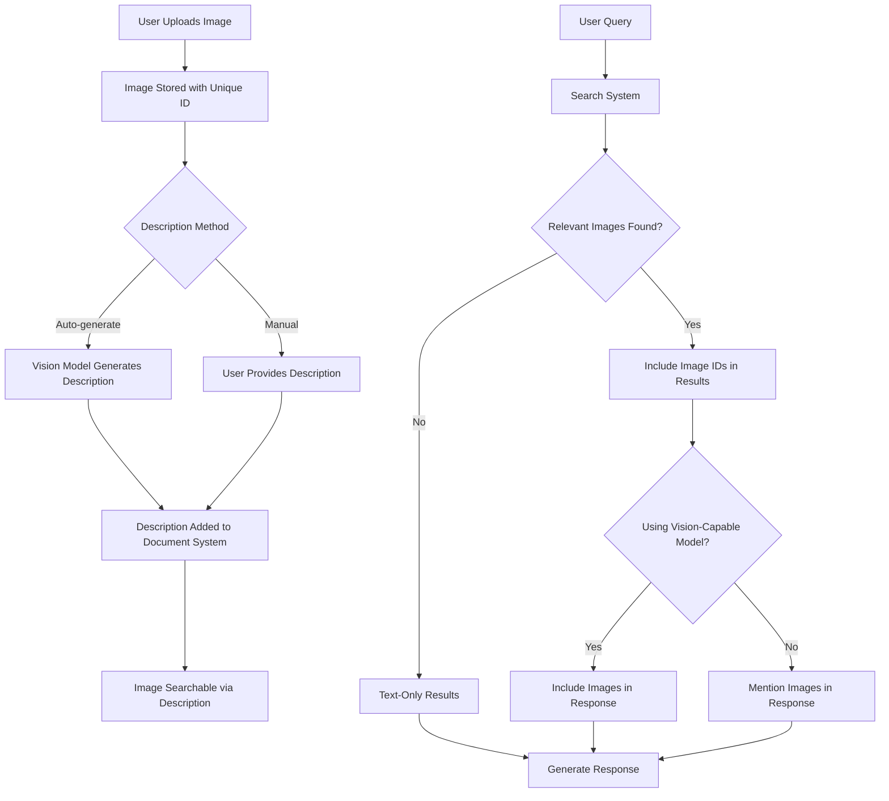

# Publicia Image Handling System

Publicia includes a sophisticated image handling system that allows users to add, view, and search for images. This document explains the key components and workflow of the image handling process.

## Overview

The image handling functionality combines the following capabilities:

-   **Image Storage:** Images are stored with unique IDs and metadata.
-   **Image Description:** Images can be described either automatically using vision-capable AI models or manually by users.
-   **Searchable Descriptions:** Image descriptions are integrated into the document search system.
-   **Vision-Capable Response:** When relevant images are found in search results, they can be included in responses from vision-capable models.
-   **Discord Integration:** Users can interact with the image system through Discord commands.

## Workflow



## Components and Code References

### 1. Image Management (`managers/images.py`)

-   **`ImageManager`:** The core class responsible for managing images.
    -   **`add_image`:** Stores a new image with metadata and adds its description to the document system.
    -   **`get_image`:** Retrieves image data and description by ID.
    -   **`get_base64_image`:** Gets base64-encoded image data for use in API calls.
    -   **`list_images`:** Lists all images with their metadata.
    -   **`delete_image`:** Removes an image and its associated description document.
    -   **`update_description`:** Updates the description for an existing image.

### 2. Image Description Generation (`bot.py`)

-   **`DiscordBot._generate_image_description`:** Generates descriptions for images using vision-capable AI models.
    -   Uses the OpenRouter API to access vision models.
    -   Guided by the `IMAGE_DESCRIPTION_PROMPT` from `prompts/image_prompt.py`.
    -   Focuses on describing visual elements with potential connections to the lore.

### 3. Image Integration with Search (`bot.py` and `managers/documents.py`)

-   **Document Integration:** Image descriptions are stored as documents with special metadata.
    -   Each image description is stored as a document with name format `image_{image_id}.txt`.
    -   The document metadata includes references to the associated image.
    
-   **Search Results Processing:**
    -   When search results include image descriptions, the associated image IDs are extracted.
    -   Images are formatted differently in the raw document context provided to the AI model.

### 4. Vision-Capable Response Generation (`bot.py`)

-   **`DiscordBot._try_ai_completion`:** Handles including images in API calls to vision-capable models.
    -   Detects if vision capabilities are needed based on presence of images.
    -   Checks if the selected model supports vision capabilities.
    -   Formats messages with images for multimodal models.
    -   Provides fallback handling for non-vision models.

-   **Image Attachment Processing:**
    -   **`DiscordBot._download_image_to_base64`:** Converts image attachments to base64 format.
    -   Attachments are processed and included in the API call if a vision-capable model is used.

### 5. User Commands (`commands/image_commands.py`)

-   **Image Addition:**
    -   **`addimage_prefix`:** Adds an image with optional auto-generated description.
    
-   **Image Management:**
    -   **`list_images`:** Lists all images in the system.
    -   **`view_image`:** Displays an image and its description.
    -   **`edit_image_prefix`:** Allows editing an image description through conversation.
    -   **`remove_image`:** Removes an image from the system.
    -   **`update_image_description`:** Updates an image description directly.

## Technical Implementation Details

### Image Storage

Images are stored in the `images` directory with unique UUIDs as filenames. Metadata is stored in a JSON file and includes:

```json
{
  "image_id": {
    "name": "User-provided name",
    "added": "ISO timestamp",
    "description": "Image description text",
    "path": "Path to the image file"
  }
}
```

### Search Integration

When an image is added:

1. The image file is saved with a UUID as the filename
2. A document is created with the image description
3. The document's metadata includes a reference to the image ID
4. The document is indexed for search like any other document

When a search is performed:

1. If a search result includes an image reference, the image ID is extracted
2. For vision-capable models, the image is included in the API call
3. For non-vision models, the image is mentioned in the context but not shown

### Vision Model Integration

The system dynamically handles vision capabilities:

1. Determines if images are present (from search results or attachments)
2. Checks if the user's preferred model supports vision
3. For vision-capable models:
   - Converts images to base64 format
   - Includes images in the API call as multimodal content
4. For non-vision models:
   - Notifies the user that images will not be processed
   - Includes only text descriptions in the context

## Summary

The image handling system provides a comprehensive solution for managing, describing, and searching images. It integrates with the document search system to make images discoverable through their descriptions and leverages vision-capable AI models to both generate descriptions and include visual content in responses when appropriate.
