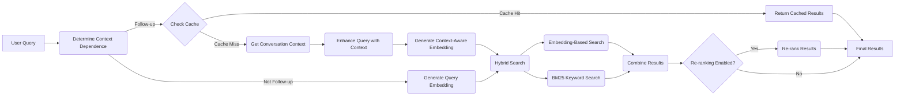

# Publicia Search Functionality

Publicia uses a sophisticated hybrid search system to provide relevant results to user queries. This document explains the key components and workflow of the search process.

## Overview

The search functionality combines the following techniques:

-   **Embedding-based search:** Uses semantic similarity between the query and document chunks.
-   **Keyword-based search (BM25):**  Uses traditional keyword matching.
-   **Contextualized embeddings:**  Embeddings are generated for document chunks *with* added context, improving retrieval accuracy.
-   **Conversation context:**  The bot considers previous messages in the conversation to understand the current query.
-   **Caching:**  Previous search results are cached to speed up follow-up queries.
-   **Re-ranking (Optional):** A final re-ranking step can further refine the results.

## Workflow

## Components and Code References

### 1. Query Processing (`bot.py`)

-   **`DiscordBot.process_hybrid_query`:**  The main entry point for handling user queries.
    -   Determines if the query is context-dependent (`is_context_dependent_query`).
    -   Retrieves conversation context (`get_conversation_context`).
    -   Enhances the query with context if needed (`enhance_context_dependent_query`).
    -   Generates a context-aware embedding if needed (`generate_context_aware_embedding`).
-   **`DiscordBot.is_context_dependent_query`:** Checks if a query likely relies on previous conversation turns.
-   **`DiscordBot.get_conversation_context`:** Extracts relevant context from the conversation history.
-   **`DiscordBot.enhance_context_dependent_query`:**  Rewrites the query to incorporate conversation context.
- **`DiscordBot.generate_context_aware_embedding`:** Creates an embedding that combines the current query with conversation context.

### 2. Search Execution (`managers/documents.py`)

-   **`DocumentManager.search`:**  Performs the core search operation.
    -   Calls `custom_search_with_embedding` for embedding-based search.
    -   Calls `_search_bm25` for keyword-based search.
    -   Calls `_combine_search_results` to merge results from both methods.
    -   Optionally calls `rerank_results` for re-ranking.
-   **`DocumentManager.custom_search_with_embedding`:**  Performs embedding-based search using a pre-generated embedding.
-   **`DocumentManager._search_bm25`:** Performs keyword-based search using the BM25 algorithm.
-   **`DocumentManager._combine_search_results`:**  Combines results from embedding-based and BM25 search, normalizing and weighting scores.
-   **`DocumentManager.rerank_results`:**  (Optional) Re-ranks search results using a more sophisticated embedding-based approach.

### 3. Contextualized Embeddings (`managers/documents.py`)

-   **`DocumentManager.contextualize_chunks`:** Generates contextual descriptions for document chunks using the Gemini 2.0 Flash model.
-   **`DocumentManager.generate_embeddings`:**  Generates embeddings for text chunks, including contextualized chunks.  The `task_type` parameter distinguishes between query and document embeddings.
-   **`DocumentManager.get_contextualized_chunk`:** Retrieves the contextualized version of a chunk during search.

### 4. Caching (`bot.py`)

-   **`DiscordBot.cache_search_results`:** Stores previous search results for potential use in follow-up queries.
-   **`DiscordBot.get_additional_results`:** Retrieves additional, unseen results from the cache.

## Summary

The search process leverages contextualized embeddings, hybrid search techniques (embeddings + BM25), optional re-ranking, and caching to provide highly relevant and context-aware results to user queries.
